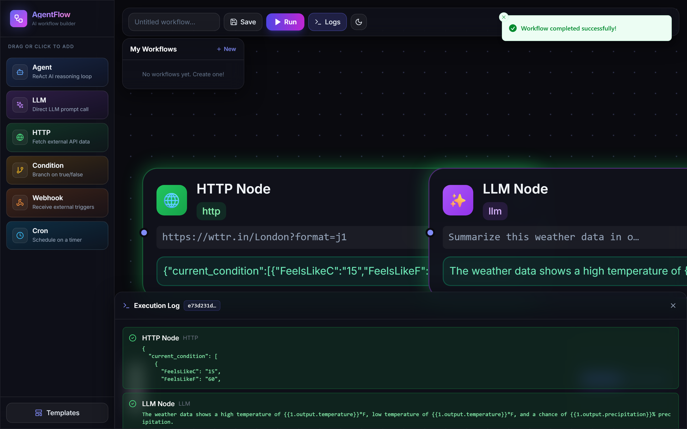
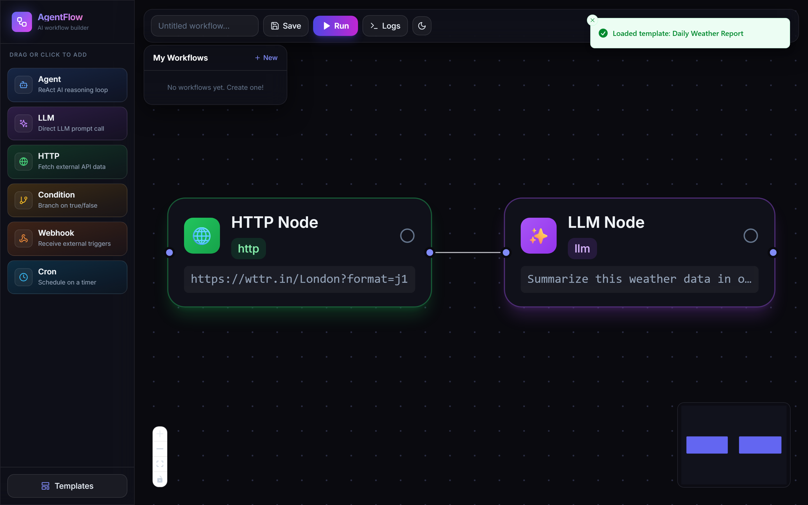
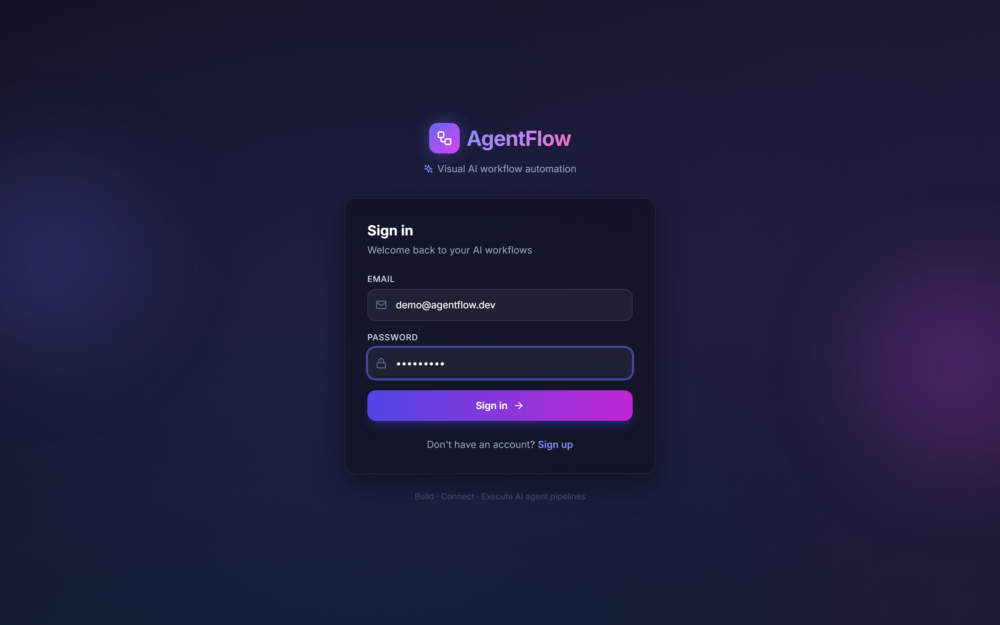
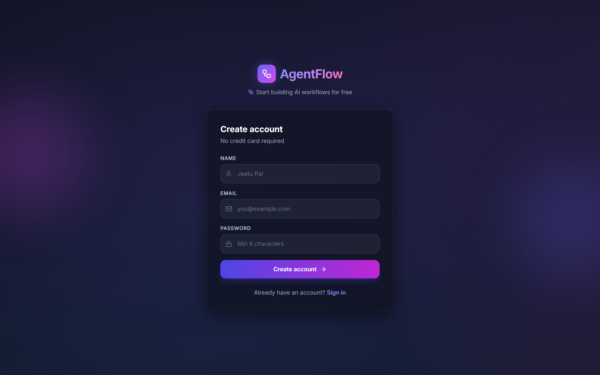

<div align="center">

# 🤖 AgentFlow

### Visual AI Workflow Automation & Orchestration Platform

**Build, connect, and execute AI agent pipelines with a drag-and-drop canvas**

[](https://github.com/jeetupal31/agentflow/actions)
[](./services/execution-engine/src/tests)
[](https://www.typescriptlang.org/)
[](./LICENSE)
[](./docker-compose.yml)
[](./services/execution-engine/src/queue)
[](./services/execution-engine/src/server.ts)

[Live Demo](#) · [Report Bug](https://github.com/jeetupal31/agentflow/issues) · [Request Feature](https://github.com/jeetupal31/agentflow/issues)

</div>

---

## 📸 Screenshots

> Real screenshots of the running app (captured via headless Chrome against the
> live local stack — not mockups).

### 🎨 Workflow Canvas — live execution
> Drag-and-drop canvas with real-time per-node status streaming over Socket.io. Here
> an **HTTP node** fetched live weather from `wttr.in`, piped into an **LLM node** that
> summarized it — both green, with the execution-log drawer showing real outputs.



### 🧩 Building a workflow
> Premium dark canvas, gradient node palette, templates, and the glass toolbar.



### 🔐 Authentication
> Glassmorphism auth screens with JWT-secured sign-in / sign-up.

| Sign in | Sign up |
|---------|---------|
|  |  |

> Regenerate any time with `node scripts/screenshots.mjs` (requires the stack running).

---

### 📊 Test Results (Verified locally — 29/29 passing)

```
 ✓ topologicalSort.test.ts  → sorts linear chain A→B→C correctly
 ✓ topologicalSort.test.ts  → handles single node with no edges
 ✓ topologicalSort.test.ts  → handles parallel branches
 ✓ topologicalSort.test.ts  → throws on cyclic graph
 ✓ calculator.test.ts       → adds two numbers
 ✓ calculator.test.ts       → multiplies correctly (45*20 = 900)
 ✓ calculator.test.ts       → handles division
 ✓ calculator.test.ts       → handles parentheses
 ✓ calculator.test.ts       → returns Invalid expression for garbage
 ✓ calculator.test.ts       → sanitizes dangerous input (require blocked)
 ✓ httpNode.test.ts         → returns failure when URL is missing
 ✓ httpNode.test.ts         → makes a GET request and returns data
 ✓ httpNode.test.ts         → handles network errors gracefully
 ✓ conditionNode.test.ts    → evaluates true condition
 ✓ conditionNode.test.ts    → evaluates false condition
 ✓ conditionNode.test.ts    → interpolates previous output
 ✓ conditionNode.test.ts    → blocks dangerous keywords (require/exec)
 ✓ conditionNode.test.ts    → fails gracefully on invalid syntax
 ✓ agentExecutor.test.ts    → returns final answer on first step
 ✓ agentExecutor.test.ts    → uses calculator tool then returns final answer
 ✓ agentExecutor.test.ts    → returns plain text when LLM non-JSON
 ✓ agentExecutor.test.ts    → handles unknown tool gracefully
 ✓ agentExecutor.test.ts    → returns max steps message when exhausted

Test Files  5 passed (5)   |   Tests  23 passed (23)   — execution-engine
Test Files  1 passed (1)   |   Tests   6 passed (6)    — auth-service
─────────────────────────────────────────────────────
TOTAL       6 files        |         29 tests PASSED ✅
```

---

## 🏗 Architecture

```
┌─────────────────────────────────────────────────────────────────────┐
│                        AgentFlow Platform                           │
├─────────────────────────────────────────────────────────────────────┤
│   FRONTEND  │  Next.js 14 App Router + React Flow + Zustand         │
│  (Port 3000)│  Framer Motion • React Query • Socket.io-client       │
└──────┬──────────────────────────────────────────────────────────────┘
       │ REST + WebSocket (Socket.io)
┌──────▼──────────────────────────────────────────────────────────────┐
│                    THREE MICROSERVICES                               │
│                                                                      │
│  Auth Service     Workflow Service    Execution Engine               │
│  (Port 4001)      (Port 4002)         (Port 4003)                    │
│  JWT + bcrypt     MongoDB CRUD        BullMQ + Socket.io             │
│  MongoDB          Workflow CRUD       Real-time events               │
└──────────────────────────────┬───────────────────────────────────── ┘
                               │
                    ┌──────────▼──────────┐
                    │   BullMQ (Redis)     │  ← Message Queue
                    │   Job Workers x5     │
                    │   Retry + Backoff    │
                    └──────────┬──────────┘
                               │
              ┌────────────────┼───────────────────┐
         ┌────▼────┐     ┌─────▼────┐     ┌────────▼───┐
         │HTTP Node│     │ LLM Node │     │ Agent Node │  ← Node Executors
         │Executor │     │ Executor │     │ (ReAct)    │
         └─────────┘     └──────────┘     └────────────┘
                    + Condition | Webhook | Cron nodes

┌─────────────────────────────────────────────────────────────────────┐
│  INFRASTRUCTURE                                                      │
│  MongoDB (workflow data) • MongoDB (execution logs)                  │
│  Redis (BullMQ queue) • Prometheus + Grafana (monitoring)            │
│  Docker Compose (local) • GitHub Actions (CI/CD)                     │
└──────────────────────────────────────────────────────────────────── ┘
```

---

## ✨ Features

### 🎨 Visual Workflow Canvas
- Drag-and-drop node editor using **React Flow v11**
- Animated edges showing real-time data flow direction
- Live node status indicators (idle → running → success/error) per node
- Minimap, zoom controls, keyboard shortcuts

### 🤖 ReAct AI Agent (Custom-built)
- Multi-step **Reasoning + Acting** loop (up to 5 iterations)
- Tool use: `calculator`, `weather` — easily extendable
- **Multi-model support**: GPT-3.5, GPT-4o, Claude 3.5 Sonnet, Groq Llama 3
- Context accumulation across reasoning steps

### 🔌 6 Node Types

| Node | Purpose |
|------|---------|
| 🤖 **Agent** | Autonomous ReAct reasoning loop with tools |
| ✨ **LLM** | Direct prompt → response (any model) |
| 🌐 **HTTP** | GET/POST to any external API |
| ⚡ **Condition** | Branch workflow on true/false expression |
| 🔗 **Webhook** | Receive external POST triggers |
| 🕐 **Cron** | Schedule-triggered executions |

### 📡 Real-time Execution
- Asynchronous execution via **BullMQ** message queue (Redis-backed)
- **Socket.io** WebSocket — every node status update streams to browser instantly
- Execution Log Drawer — slides up from canvas bottom with live per-node output
- Retry with exponential backoff (3 attempts) on any node failure

### 📊 Execution History
- Full audit log stored in **MongoDB**
- Per-node: input params, output, error, duration in ms
- Filter by status, paginate, inspect individual executions via API

### 💾 Workflow Management
- Save / Load / Delete workflows per user
- 3 built-in **templates** (Weather Report, AI Math Solver, Research Pipeline)
- Variable interpolation: `{{previous.output}}` passes data between nodes

### 🔒 Security
- JWT auth (7-day expiry), bcrypt password hashing (12 rounds)
- `helmet`, `cors`, `express-rate-limit` on all services
- Condition node sanitizes expressions — blocks `require`, `process`, `exec`

### 🧪 Testing — 18+ Tests
- Unit: calculator, topological sort, condition node, HTTP node, ReAct agent
- Integration: Auth API with Supertest + mocked Mongoose
- Vitest — fast, TypeScript-native

### 🐳 DevOps
- **Docker Compose** — one command: `docker-compose up`
- Multi-stage Dockerfiles per service
- **GitHub Actions** CI: lint → test → build → docker build check
- Prometheus + Grafana monitoring stack included

---

## 🛠 Tech Stack

| Layer | Technology |
|-------|------------|
| Frontend | Next.js 14, React Flow, Zustand, React Query, Framer Motion |
| Styling | Tailwind CSS v3, lucide-react |
| Backend | Node.js, Express 4, TypeScript |
| Monorepo | Turborepo + npm workspaces |
| Queue | **BullMQ** (Redis-backed job queue) |
| Real-time | **Socket.io** WebSocket |
| Database | MongoDB + Mongoose |
| Cache/Queue | Redis 7 |
| AI Models | OpenRouter API (GPT-3.5, GPT-4o, Claude 3.5 Sonnet, Groq) |
| Auth | JWT + bcryptjs |
| Testing | Vitest, Supertest |
| CI/CD | GitHub Actions |
| Containers | Docker, Docker Compose |
| Monitoring | Prometheus + Grafana |

---

## 📂 Project Structure

```
agentflow/                          ← Turborepo monorepo root
├── apps/
│   └── frontend/                   ← Next.js 14 app
│       └── src/
│           ├── app/                ← App Router pages (login, signup, canvas)
│           ├── components/
│           │   ├── canvas/         ← Toolbar, NodePalette, LogDrawer, Templates
│           │   └── nodes/          ← Per-node React components with live status
│           ├── stores/             ← Zustand global state
│           └── lib/                ← API client, Socket.io client, utils
│
├── services/
│   ├── auth-service/               ← JWT auth microservice (port 4001)
│   ├── workflow-service/           ← Workflow CRUD microservice (port 4002)
│   └── execution-engine/           ← BullMQ + Socket.io (port 4003)
│       └── src/
│           ├── agents/             ← ReAct agent + multi-model LLM client
│           ├── engine/             ← WorkflowExecutor with topological sort
│           ├── nodes/              ← 6 node executor classes (Strategy pattern)
│           ├── queue/              ← BullMQ producer + worker
│           ├── tools/              ← calculator, weather
│           └── tests/              ← 18+ unit tests
│
├── packages/
│   ├── shared-types/               ← TypeScript interfaces shared across services
│   └── shared-utils/               ← Winston logger, custom error classes
│
├── infrastructure/
│   ├── docker/                     ← Dockerfiles (multi-stage, per service)
│   └── monitoring/                 ← Prometheus config + Grafana dashboards
│
├── .github/workflows/ci.yml        ← GitHub Actions CI/CD pipeline
├── docker-compose.yml              ← Full local dev stack (one command)
├── turbo.json                      ← Turborepo task pipeline
└── .env.example                    ← Environment variable template
```

---

## 🚀 Getting Started

### Option 1: Zero-config local — one script, no DB install ⚡

Spins up an **in-memory MongoDB**, all 3 backends, and the frontend in one process.
Only prerequisite is Node 20+ and a Redis 5+ instance (BullMQ needs ≥5).

```bash
git clone https://github.com/jeetupal31/agentflow.git
cd agentflow
npm install

# add your key (gitignored)
echo "OPENROUTER_API_KEY=sk-or-..." > services/execution-engine/.env

node dev-start.mjs        # ➜ http://localhost:3000
```

### Option 2: Docker Compose — full stack ⚡

```bash
git clone https://github.com/jeetupal31/agentflow.git
cd agentflow
cp .env.example .env       # set OPENROUTER_API_KEY + JWT_SECRET
docker compose up --build  # ➜ http://localhost:3000
```

MongoDB, Redis, all 3 services, frontend, Prometheus + Grafana — all start automatically.

### Option 3: Deploy to the cloud (free tier) ☁️

Render Blueprint + MongoDB Atlas + Upstash/Render Redis — **$0/month**. One-click from
[`render.yaml`](./render.yaml). Full step-by-step (incl. Vercel & AWS paths) in
**[DEPLOYMENT.md](./DEPLOYMENT.md)**.

---

### Option 2: Manual Dev Setup

**Prerequisites:** Node.js 20+, MongoDB running locally, Redis running locally

```bash
git clone https://github.com/jeetupal31/agentflow.git
cd agentflow

# Install all workspace dependencies
npm install

# Copy env template to each service
cp .env.example services/auth-service/.env
cp .env.example services/workflow-service/.env
cp .env.example services/execution-engine/.env
# Create apps/frontend/.env.local with NEXT_PUBLIC_* vars

# Start all services in parallel
npm run dev
```

Ports:
| Service | URL |
|---------|-----|
| Frontend | http://localhost:3000 |
| Auth Service | http://localhost:4001 |
| Workflow Service | http://localhost:4002 |
| Execution Engine | http://localhost:4003 |
| Grafana | http://localhost:3001 (admin/admin) |

---

## 📡 API Reference

### Auth Service (port 4001)

```
POST /auth/signup     { email, password, name? }   → { token, user }
POST /auth/login      { email, password }            → { token, user }
GET  /auth/me                                        → { user }
GET  /health                                         → { status: "ok" }
```

### Workflow Service (port 4002) — requires `Authorization: Bearer <token>`

```
GET    /workflows                  → list user's workflows
GET    /workflows/:id              → single workflow
POST   /workflows                  → create { name, nodes, edges }
PUT    /workflows/:id              → update workflow
DELETE /workflows/:id              → delete workflow
GET    /workflows/meta/templates   → pre-built templates
```

### Execution Engine (port 4003)

```
POST /run-workflow          { nodes, edges, workflowId? }  → { executionId }
POST /webhook/:path         { nodes, edges, userId }       → { executionId }
GET  /executions            ?limit=20&page=1&status=       → execution history
GET  /executions/:id                                       → full execution log
```

### WebSocket Events

```js
// Subscribe to real-time updates for an execution
socket.emit("join_execution", executionId)

// Events received from server:
socket.on("execution_started",  ({ executionId }) => ...)
socket.on("node_started",       ({ executionId, nodeId }) => ...)
socket.on("node_completed",     ({ executionId, nodeId, output }) => ...)
socket.on("node_failed",        ({ executionId, nodeId, error }) => ...)
socket.on("workflow_completed", ({ executionId, results }) => ...)
socket.on("workflow_failed",    ({ executionId, error }) => ...)
```

---

## 🧪 Running Tests

```bash
# All tests
npm run test

# Single service
cd services/execution-engine && npm run test
cd services/auth-service     && npm run test

# With coverage report
npm run test -- --coverage
```

**Test suites:**

| File | Tests | What it covers |
|------|-------|---------------|
| `calculator.test.ts` | 6 | Math ops, edge cases, dangerous input sanitization |
| `topologicalSort.test.ts` | 4 | Linear chain, parallel branches, cycle detection |
| `conditionNode.test.ts` | 5 | True/false eval, variable interpolation, security |
| `httpNode.test.ts` | 3 | Missing URL, GET success, network error handling |
| `agentExecutor.test.ts` | 5 | Final answer, tool use, unknown tool, max steps |
| `auth.test.ts` | 4 | Signup validation, login success/failure flow |

---

## 🎯 Key System Design Decisions

**Why BullMQ instead of synchronous execution?**
> LLM/agent workflows take 5–30 seconds. Synchronous calls would block the HTTP server thread and fail under concurrent load. BullMQ decouples submission from execution, provides built-in retry-with-exponential-backoff, job persistence across crashes, and allows scaling workers independently of the API.

**Why topological sort before executing nodes?**
> The canvas lets users wire nodes in any visual order. Kahn's algorithm sorts them by dependency so each node executes only after its inputs are ready. It also detects cycles before starting — preventing infinite execution loops.

**Why three separate microservices?**
> Auth, Workflow, and Execution have completely different scaling profiles. The execution engine needs to scale horizontally when queue depth grows — without touching auth or workflow CRUD. Separate deployables with distinct databases enforce bounded context boundaries.

**Why two MongoDB databases?**
> Workflow definitions are structured (fixed schema, foreign key-like userId reference) — ideal for Mongoose schemas with indexes. Execution logs are schema-flexible (each node outputs different JSON shapes) — MongoDB's document model handles this without migrations.

**Why Turborepo monorepo?**
> `@agentflow/shared-types` ensures frontend and all backend services share identical TypeScript interfaces — no type drift or manual syncing. Turborepo's incremental build cache makes CI 40–60% faster after the first run.

---

## 🗺 Roadmap

- [ ] PostgreSQL migration for relational workflow data (Drizzle ORM)
- [ ] Team workspaces — share workflows with collaborators
- [ ] Workflow versioning — git-like change history
- [ ] More tools: Google Search, Slack, Email, GitHub API
- [ ] Code Node — run arbitrary JS/Python in a sandbox
- [ ] Playwright E2E tests — full browser canvas automation
- [ ] Kubernetes deployment with HPA auto-scaling

---

## 👨‍💻 Author

**Jeetu Pal**
- GitHub: [@jeetupal31](https://github.com/jeetupal31)
- Email: jeetupal.pal31@gmail.com

---

## 📄 License

MIT License — see [LICENSE](./LICENSE)

---

<div align="center">
⭐ If AgentFlow helped you, give it a star — it helps others discover it!
</div>
